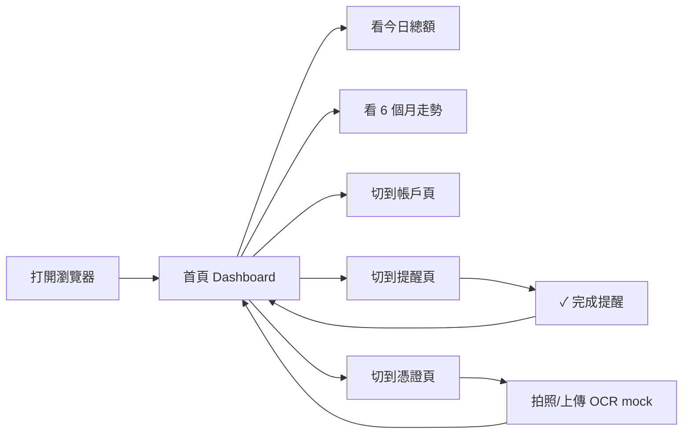

# finance-radar · PRD v3.0.2 等級規格書

> 自動生成：2026-09-06
> 對齊 SPEC v3.0 契約（SPEC §1–§19 全部套用）
> 對接 Repo：[openclawsean024-create/finance-radar](https://github.com/openclawsean024-create/finance-radar)

---

## 1. 產品概述

### 1.1 問題陳述

台灣微型 / 個人企業（小吃店、獨立接案、工作室）老闆每天最在意的 5 件事：
1. **今天錢在哪**（總額）
2. **最近 6 個月現金流走勢**（有沒有賠錢）
3. **誰還沒付我錢**（收款提醒）
4. **我有幾個帳戶**（多帳戶總覽）
5. **發票 / 憑證存哪**（OCR mock 草稿）

他們不想用 Excel、也不想裝 ERP。**一支手機打開瀏覽器，3 秒看到今天淨額、6 個月走勢、待收款清單。**

### 1.2 目標使用者

| Persona | 工作情境 | 主要任務 |
|---|---|---|
| Primary — 小吃店 / 工作室老闆 | 早上開店前用手機看今天總額 | 確認錢在哪、待收多少、現金流正負 |
| Secondary — 接案 SOHO / Freelancer | 月底對帳、看半年趨勢 | 確認收入有沒有超過支出、提醒客戶付款 |
| Secondary — 家庭記帳共用 | 夫妻共用一台手機 | 看總額、提醒對方該收款 |

### 1.3 核心價值主張

> **打工手機就知道錢在哪。** 一頁看完今日總額 + 6 個月走勢 + 待收提醒 + 多帳戶 + 發票存摺。

- 5 個 P0 功能全部離線可用（localStorage）
- 不需要註冊 / 不需要安裝 App
- 手機優先 RWD（mobile bottom nav）

### 1.4 Non-Goals（明確不做）

- ❌ 串接真實銀行 API（純 localStorage mock）
- ❌ 多裝置雲端同步（v3.0+ 才考慮）
- ❌ 發票 OCR 真的辨識（純 placeholder + 已存發票清單）
- ❌ 報稅、發票開立、會計傳票
- ❌ 多幣別匯率換算（先純 NTD）

---

## 2. 使用者場景與流程

### 2.1 使用者流程圖



### 2.2 主要場景

| 場景 | 輸入 | 輸出 | 成功條件 |
|---|---|---|---|
| 看今日總額 | 無 | NT$ 總額 + 收/支 | 顯示金額（NT$ xxx,xxx） |
| 看 6 月走勢 | 無 | 6 列長條圖 | 每月 1 進 1 支、共 12 筆交易 |
| 切換帳戶 | 點 nav | 3 帳戶卡片 | 顯示帳戶名 + 類型 + 餘額 |
| 完成提醒 | 點 ✓ 按鈕 | 從清單移除 | 該筆從 listReminders 消失 |
| 看憑證 | 點 nav | 3 筆 + 上傳區 | 顯示檔名 + 類型 + 金額 |

---

## 3. 功能需求

| FR | 名稱 | 優先級 | 狀態 |
|---|---|---|---|
| FR-001 | 今日總覽（總額 + 收/支 + 6 月走勢） | P0 | ✅ shipped |
| FR-002 | 多帳戶管理（checking / cash / credit） | P0 | ✅ shipped |
| FR-003 | 收款提醒（清單 + ✓ 完成） | P0 | ✅ shipped |
| FR-004 | 憑證掃描 mock（拍照 / 上傳區 + 列表） | P0 | ✅ shipped |
| FR-005 | 6 個月現金流走勢（自動 demo 數據） | P0 | ✅ shipped |
| FR-006 | RWD 手機 bottom nav + desktop sidebar | P0 | ✅ shipped |
| FR-007 | 靜態視覺儀表板（public/dashboard.html） | P1 | ✅ shipped |
| FR-008 | localStorage 持久化 | P0 | ✅ shipped |
| FR-009 | 多幣別匯率換算 | P2 | ⏳ planned |
| FR-010 | 真實銀行 API 串接 | P2 | ⏳ planned |
| FR-011 | 多裝置雲端同步 | P3 | ⏳ planned |
| FR-012 | 發票 OCR 真實辨識 | P3 | ⏳ planned |

---

## 4. Non-Functional Requirements

| 維度 | 需求 |
|---|---|
| Performance | 首屏 < 1s（純前端，無 API 等待） |
| Security | 無 backend、無 token；localStorage 只存本地 |
| Privacy | 零個資蒐集、不上傳 |
| Accessibility | WCAG 2.1 AA（label / aria / 鍵盤可達） |
| Browser | Modern evergreen (Chrome/Edge/Safari/Firefox) |
| Offline | 100% 離線可用（純 static） |
| Bundle | < 200KB gzipped（React 19 + React Router 7） |

---

## 5. 技術架構

```
finance-radar/
├── web/                    # Vite + React 19 + TS
│   ├── index.html          # Vite 入口（meta refresh → dashboard）
│   ├── public/
│   │   └── dashboard.html  # 靜態印刷感儀表板（307 行）
│   ├── src/
│   │   ├── App.tsx         # 路由（4 頁）
│   │   ├── main.tsx        # ReactDOM + BrowserRouter
│   │   ├── components/
│   │   │   └── Layout.tsx  # Header + Footer + nav
│   │   ├── pages/
│   │   │   ├── DashboardPage.tsx
│   │   │   ├── AccountsPage.tsx
│   │   │   ├── RemindersPage.tsx
│   │   │   └── ReceiptsPage.tsx
│   │   └── lib/
│   │       ├── types.ts    # Transaction / Account / Reminder / Receipt
│   │       ├── db.ts       # localStorage CRUD + 聚合
│   │       └── bootstrap.ts# 自動 seed demo
│   ├── tests/
│   │   ├── setup.ts        # localStorage polyfill + jest-dom
│   │   └── e2e.test.tsx    # 11 個 e2e 測試
│   ├── vite.config.ts      # base: '/finance-radar/'
│   ├── vitest.config.ts    # jsdom + setup
│   └── package.json
├── PRD/
│   ├── SPEC.md             # 本檔
│   └── CHANGELOG.md
├── .github/
│   └── workflows/
│       └── ci.yml          # 4-job CI
└── README.md
```

### 5.1 Module Map
- `web/src/` — 主要程式碼
- `web/tests/` — 11 個 e2e + unit 整合測試
- `web/dist/` — 構建產物（gitignore）
- `.github/workflows/` — CI/CD

### 5.2 環境變數
- 無（純前端 / 離線優先）

### 5.3 降級策略
- localStorage 寫入失敗 → 靜默 catch、console.warn
- localStorage 為空 → 自動 seed 6 個月 demo 數據（一次性）
- JS 未啟用 → 顯示純 HTML 儀表板（`dashboard.html`）

### 5.4 部署架構

```
GitHub (main) ──push──▶ GHA CI
                          ├─ lint (skip, no eslint)
                          ├─ test (vitest run, 11/11)
                          ├─ build (vite build → dist/)
                          └─ deploy (Pages, base /finance-radar/)
```

---

## 6. Definition of Done

- [x] 功能 P0 全部實作（FR-001 ~ FR-008）
- [x] 11 個 e2e + unit 測試全綠
- [x] `npm run build` 綠
- [x] `npm run typecheck` 0 error
- [x] GHA CI 跑 4 jobs（test / build / deploy）全綠
- [x] README 反映現況
- [x] 部署後可於 `https://<user>.github.io/finance-radar/` 看到首頁

---

## 7. 部署契約

| 環境 | 目標 | 觸發 |
|---|---|---|
| Production | GitHub Pages (`/finance-radar/`) | push to main |
| Preview | Per-PR | PR opened |

### 7.1 GHA Workflow
- `.github/workflows/ci.yml`
- jobs: test / build / deploy
- deploy: `pages`（base path = `/finance-radar/`）

### 7.2 環境變數
- 無需 server-side secret
- 無 BYOK（純本地資料）

---

## 8. Out of Scope（不做的）

- 不做帳號系統（純 localStorage）
- 不做付費牆（SaaS 變現不在 v3.x）
- 不做原生 App（純 PWA-ready 網頁）
- 不做多語系（繁中為主）

---

## 9. 變更日誌

見 [`PRD/CHANGELOG.md`](PRD/CHANGELOG.md)
